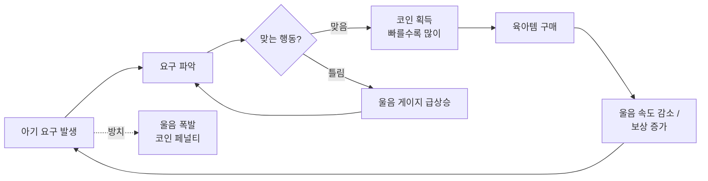

# 🍼 육아 타이쿤 (ddooby-baby-tycoon)

> 새벽 3시, 아기가 운다. 뭘 원하는지 맞혀라.

붕어빵 타이쿤식 주문-대응 루프를 육아로 옮긴 캐주얼 웹 게임. 모바일 브라우저 우선, 반응형.

<!-- M4에서 플레이 GIF 추가 -->


[](https://github.com/Ddoobyddooby/ddooby-baby-tycoon/actions/workflows/ci.yml)

## 목차

- [빠른 시작](#빠른-시작)
- [지금 되는 것](#지금-되는-것-v01-초안)
- [코어 루프](#코어-루프)
- [일정](#일정)
- [설계 결정](#설계-결정)
- [알려진 이슈 & 결정 대기](#알려진-이슈--결정-대기)
- [레포 구성](#레포-구성)
- [문서](#문서)
- [GitHub 초기 세팅](#github-초기-세팅)

## 빠른 시작

```bash
git clone https://github.com/Ddoobyddooby/ddooby-baby-tycoon.git
cd ddooby-baby-tycoon
nvm use          # Node 22
npm install
npm run dev      # http://localhost:5173
```

폰으로 바로 보려면 `npm run dev -- --host` 후 같은 와이파이에서 표시된 주소로 접속.

| 명령            | 설명                                                        |
| --------------- | ----------------------------------------------------------- |
| `npm run dev`   | 개발 서버                                                   |
| `npm test`      | 단위 테스트                                                 |
| `npm run check` | lint → typecheck → test → build (CI와 동일, **PR 전 필수**) |

## 지금 되는 것 (v0.1 초안)

- 아기가 4가지 요구(🍼 배고픔 · 🧷 기저귀 · 😴 졸림 · 🧸 심심)를 랜덤으로 표현
- 울음 링 게이지가 차오르고, 75% 넘으면 빨갛게 흔들림, 100%면 폭발
- 맞는 행동을 빨리 할수록 코인 많이 획득, 틀리면 울음 급상승
- 육아템 상점 5종 (요구별 울음 속도 감소 / 보상 증가)
- 코인 · 업그레이드 자동 저장 (localStorage)

## 코어 루프



비주얼 방향은 **"새벽 3시 아기방"**. 어둑한 남색 벽에 유일한 광원은 수유등의 노란빛이고, 울음이 차오르면 링이 노랑에서 빨강으로 번진다.

## 일정

주 15시간(평일 저녁 1.5h × 4 + 주말 4.5h × 2) 기준. 매주 버퍼 2시간 별도 확보.

| 마일스톤         | 기간          | 핵심 질문                   | 완료 조건                                 |
| ---------------- | ------------- | --------------------------- | ----------------------------------------- |
| **M0 준비**      | ~ 10/11       | 바로 시작할 수 있나?        | 레포 push, CI 통과, Vercel 프리뷰 URL     |
| **M1 코어 루프** | 10/12 ~ 10/18 | 이거 재밌나?                | 테스터 2명 플레이 후 Go/No-Go 판정        |
| **M2 경제**      | 10/19 ~ 10/25 | 계속 하고 싶나?             | 하루 정산 화면, 전체 업그레이드 10~15분   |
| **M3 손맛**      | 10/26 ~ 11/01 | 처음 보는 사람도 바로 하나? | 효과음 · 튜토리얼, 설명 없이 30초 내 이해 |
| **M4 출시**      | 11/02 ~ 11/08 | 링크 보내면 되나?           | 공개 URL + itch.io + 플레이 GIF           |

태스크 25개와 예상 시간은 [WBS](docs/02-wbs.md) 참고.

## 설계 결정

**1. 게임 규칙은 프레임워크 없는 순수 함수로 분리**

```
components ──읽기/액션──▶ store (Zustand) ──호출──▶ game/engine.ts (순수 함수)
                              ▲
            game/loop ──tick──┘
```

`engine.ts` 는 React 를 모른다. 그래서 테스트가 쉽고, 나중에 Phaser 로 옮겨도 엔진은 그대로 재사용된다. 근거는 [ADR 0001](docs/adr/0001-react-zustand.md).

**2. 요구 발생은 포아송 과정으로 계산**

`Math.random() < rate * dt` 방식은 프레임레이트에 따라 확률이 미묘하게 틀어진다. `1 - e^(-λ·dt)` 로 계산해서 60fps 든 120fps 든 같은 템포를 보장한다.

**3. 진행 중인 울음은 저장하지 않음**

코인, 업그레이드 레벨, 통계만 저장한다. 울음 99% 상태로 저장되면 재접속하자마자 폭발하기 때문.

**4. requestAnimationFrame + delta time 루프**

`setInterval` 은 탭이 비활성화되면 멈추거나 튄다. 프레임 간 경과 시간(dt)으로 진행하고, 탭 복귀 시 폭주를 막기 위해 dt 는 0.25초로 상한을 둔다.

## 알려진 이슈 & 결정 대기

- [ ] **밸런스가 너무 쉬움**: 첫 업그레이드가 약 12초 만에 가능. M2에서 조정 ([밸런스 시트](docs/04-balance.md))
- [ ] **상점을 열면 게임을 멈출지** 계속 흐르게 할지 (현재: 계속 흐름)
- [ ] **무한 모드 vs 하루(60초) 단위** 진행
- [ ] **오답 페널티(+10 울음)** 가 적절한지

위 세 가지 결정은 M1 첫 태스크(WBS 1.1)에서 직접 플레이해보고 확정한다.

## 레포 구성

```
ddooby-baby-tycoon/
├── src/
│   ├── game/            ← 순수 로직 (balance, engine, loop) + 테스트
│   ├── store/           ← Zustand 스토어 + 저장
│   ├── components/      ← Hud, Crib, ActionBar, Shop
│   └── styles/          ← 디자인 토큰 + 스타일
├── docs/                ← 기획서, WBS, 개발 환경, 밸런스, Git 워크플로, ADR
├── scripts/             ← WBS 기반 GitHub 이슈 일괄 생성
└── .github/             ← CI, PR/이슈 템플릿
```

| 영역 | 내용                                                                       |
| ---- | -------------------------------------------------------------------------- |
| 기획 | 컨셉, 코어 루프, 규칙 명세, 화면 와이어프레임, MVP 범위, 성공 기준, 리스크 |
| WBS  | 마일스톤 5개, 태스크 25개, 예상 시간 · 완료 조건, 간트 차트                |
| 품질 | ESLint, Prettier, TypeScript strict, 단위 테스트 15개                      |
| 협업 | GitHub Actions CI, PR/이슈 템플릿, Conventional Commits                    |

## 문서

| 문서                                       | 내용                                               |
| ------------------------------------------ | -------------------------------------------------- |
| [01 기획서](docs/01-planning.md)           | 컨셉, 코어 루프, 규칙 명세, 화면, MVP 범위, 리스크 |
| [02 WBS](docs/02-wbs.md)                   | 마일스톤, 태스크별 예상 시간, 완료 조건            |
| [03 개발 환경](docs/03-dev-setup.md)       | 명령어, 폴더 구조, 아키텍처 규칙, 배포             |
| [04 밸런스](docs/04-balance.md)            | 수치 근거, 분당 수익 추정, 조정 메모               |
| [05 Git 워크플로](docs/05-git-workflow.md) | 브랜치, 커밋 컨벤션, PR, 태그                      |
| [ADR 0001](docs/adr/0001-react-zustand.md) | 왜 Phaser/Unity 대신 React + Zustand 인가          |

## 스택

Vite · React · TypeScript · Zustand · Vitest · ESLint · Prettier · GitHub Actions · Vercel

## GitHub 초기 세팅

라벨 · 마일스톤 · WBS 이슈 25개를 한 번에 생성한다 ([GitHub CLI](https://cli.github.com) 필요).

```bash
gh auth login
./scripts/bootstrap-github.sh
```

배포는 [Vercel](https://vercel.com/new) 에서 이 레포를 연결하면 된다 (Framework Preset: Vite 자동 감지).
