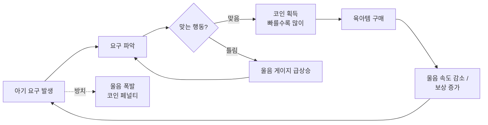

# 01. 기획서 — 육아 타이쿤

> 버전 0.1 · 작성 2026-09-29 · 상태: MVP 기획 확정 전 초안

## 1. 한 줄 컨셉

**"새벽 3시, 아기가 운다. 뭘 원하는지 맞혀라."**
붕어빵 타이쿤식 주문-대응 루프를 육아로 옮긴 캐주얼 웹 게임.

## 2. 왜 만드나

| 구분   | 목표                                                             |
| ------ | ---------------------------------------------------------------- |
| 학습   | 게임 루프(delta time), 상태 설계, 밸런싱, PWA 배포를 끝까지 경험 |
| 결과물 | 4주 안에 **링크 하나로 누구나 플레이 가능한** 완성작             |
| 확장   | 개인 → 포트폴리오 → 지인 공개 → 웹 게임 포털/앱 수익화           |

## 3. 타겟 & 레퍼런스

- **1차 타겟**: 20~40대 부모, 예비 부모. 모바일 브라우저에서 출퇴근/틈새 시간 3~5분 플레이
- **공감 포인트**: 육아해 본 사람만 웃는 디테일 (새벽 기상, 손목 분유 온도 테스트, 트림)
- **레퍼런스**: 붕어빵 타이쿤(주문 대응 루프), Cooking Fever(업그레이드로 템포 상승), 방치형 타이쿤(성장 체감)

## 4. 코어 루프



## 5. 게임 규칙 명세 (MVP)

| 요소        | 규칙                                                                      | 코드 위치                 |
| ----------- | ------------------------------------------------------------------------- | ------------------------- |
| 요구        | 4종: 배고픔 🍼, 기저귀 🧷, 졸림 😴, 심심 🧸. 한 번에 1개                  | `game/balance.ts` `NEEDS` |
| 요구 발생   | 요구가 없을 때 포아송 과정(λ=0.5/s, 평균 2초 간격)                        | `engine.tick`             |
| 울음 게이지 | 0~100. 요구가 있으면 초당 14씩 상승 → 약 7초 후 폭발                      | `engine.tick`             |
| 올바른 대응 | 보상 = 10 × max(0.3, 1 − 울음/100) × 보상배율                             | `engine.resolve`          |
| 틀린 대응   | 울음 +10 (99.9 상한, 틀려서 바로 폭발하진 않음)                           | `engine.resolve`          |
| 폭발        | 요구 사라짐, 코인 −5 (0 미만 불가), 폭발 횟수 기록                        | `engine.tick`             |
| 육아템      | 요구별 울음 속도 레벨당 −12% (최대 5레벨), 자장가 스피커는 보상 +20%/레벨 | `UPGRADES`                |
| 저장        | 코인·레벨·통계만 localStorage 저장. 진행 중인 요구는 저장 안 함           | `store/gameStore.ts`      |

## 6. 화면 구성

```
┌──────────────────────────────┐
│ 🪙 120   달래준 횟수 14 [상점] │  ← HUD
│                              │
│         ┌──────────┐         │
│         │ 🍼 배고파요 │        │  ← 요구 말풍선
│         └──────────┘         │
│          ╭───────╮           │
│         │   😢    │          │  ← 아기 + 울음 링 게이지
│          ╰───────╯           │     (75 이상이면 빨갛게 + 흔들림)
│             +8               │  ← 결과 피드백
│                              │
│ ┌────────────┐┌────────────┐ │
│ │ 🍼 분유 주기 ││ 🧷 기저귀 갈기│ │  ← 행동 버튼 (엄지 영역)
│ └────────────┘└────────────┘ │
│ ┌────────────┐┌────────────┐ │
│ │ 😴 재우기   ││ 🧸 놀아주기  │ │
│ └────────────┘└────────────┘ │
└──────────────────────────────┘
상점 = 바텀시트 (Esc / 바깥 탭으로 닫기)
```

**비주얼 방향: "새벽 3시 아기방"** — 어둑한 남색 벽, 유일한 광원은 수유등의 노란빛. 울음이 차오르면 링이 노랑 → 빨강으로 번진다. 폰트는 Jua(제목·숫자) + Gowun Dodum(본문).

## 7. MVP 범위

| ✅ MVP 포함        | ⏳ v0.2                     | 🔮 나중에                              |
| ------------------ | --------------------------- | -------------------------------------- |
| 아기 1명, 요구 4종 | 하루 단위(60초) + 정산 화면 | 아기 여러 명 동시 (어린이집 모드)      |
| 울음 게이지, 폭발  | 콤보 보너스                 | 성장 단계 (신생아→걸음마)              |
| 육아템 5종         | 효과음, 튜토리얼            | 랜덤 이벤트 (예방접종, 할머니 방문)    |
| 로컬 저장          | PWA 설치                    | 방치형 오프라인 보상                   |
| 반응형 웹 배포     | itch.io 업로드              | 웹 게임 포털 SDK, 앱 래핑, 보상형 광고 |

## 8. 성공 기준

- [ ] 처음 해보는 사람이 **설명 없이 30초 안에** 규칙을 이해한다
- [ ] 테스터 3명 중 2명 이상이 **5분 이상** 자발적으로 플레이한다
- [ ] 모바일 Safari / Chrome 에서 프레임 끊김 없이 동작한다
- [ ] 공개 URL 로 접속 가능하다

## 9. 리스크 & 대응

| 리스크                              | 영향 | 대응                                                                        |
| ----------------------------------- | ---- | --------------------------------------------------------------------------- |
| 코어 루프가 재미없음                | 치명 | W1 종료 시점에 테스트 플레이 → Go/No-Go 판정. No-Go면 W2를 기획 수정에 사용 |
| 수치 밸런스 붕괴 (너무 쉽거나 빡셈) | 높음 | 수치를 `balance.ts` 한 곳에 모으고, `04-balance.md` 표로 관리               |
| 에셋 제작에 시간 과다 소모          | 중간 | MVP는 이모지 유지. 에셋은 W3에 타임박스 4시간                               |
| 스코프 크리프                       | 높음 | 새 아이디어는 전부 `backlog` 라벨 이슈로. MVP 기간엔 손 안 댐               |

## 10. 오픈 이슈 (W1 안에 결정)

1. 상점을 열면 게임을 **멈출지**, 계속 흐르게 할지 (현재: 계속 흐름)
2. 무한 모드로 갈지, **하루(60초) 단위**로 끊을지
3. 틀린 대응 페널티가 적절한지 (+10 울음)
