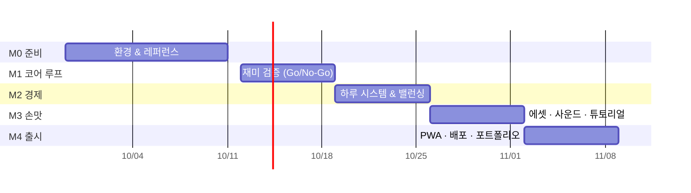

# 02. WBS & 일정

## 전제

- **가용 시간**: 평일 저녁 1.5h × 4일 + 주말 4.5h × 2일 ≈ **주 15시간**
- **계획 비율**: 주당 13h 할당 + 2h 버퍼 (버퍼는 절대 미리 쓰지 않는다)
- **단위**: 1개 태스크는 최대 4h. 넘으면 쪼갠다
- 이슈 일괄 생성: `scripts/bootstrap-github.sh` (이 표와 `scripts/wbs.tsv` 는 같은 내용)

## 마일스톤

| 마일스톤         | 기간          | 완료 조건 (Definition of Done)                       |
| ---------------- | ------------- | ---------------------------------------------------- |
| **M0 준비**      | 09/29 ~ 10/11 | 레포 push, CI 초록불, Vercel 프리뷰 URL 확보         |
| **M1 코어 루프** | 10/12 ~ 10/18 | 테스터 2명 플레이 후 Go/No-Go 판정 기록              |
| **M2 경제**      | 10/19 ~ 10/25 | 하루 정산 화면 동작, 업그레이드 전부 사는 데 10~15분 |
| **M3 손맛**      | 10/26 ~ 11/01 | 효과음·튜토리얼 포함, 첫 플레이어가 설명 없이 이해   |
| **M4 출시**      | 11/02 ~ 11/08 | 공개 URL + itch.io 페이지 + README 에 플레이 GIF     |

## 태스크

### M0 준비 (이번 스캐폴딩으로 대부분 완료)

| ID  | 태스크                                          | 예상 | 산출물                     | 상태 |
| --- | ----------------------------------------------- | ---- | -------------------------- | ---- |
| 0.1 | 프로젝트 스캐폴딩 (Vite + React + TS + Zustand) | –    | 이 레포                    | ✅   |
| 0.2 | 게임 엔진 초안 + 단위 테스트 15개               | –    | `src/game/*`               | ✅   |
| 0.3 | 기획서 / WBS / 개발 문서                        | –    | `docs/*`                   | ✅   |
| 0.4 | GitHub 레포 생성 & push                         | 0.5h | 원격 레포                  | ⬜   |
| 0.5 | 라벨·마일스톤·이슈 일괄 생성                    | 0.5h | GitHub Issues              | ⬜   |
| 0.6 | Vercel 연결 & 프리뷰 배포 확인                  | 0.5h | 프리뷰 URL                 | ⬜   |
| 0.7 | 레퍼런스 게임 3개 플레이 & 메모                 | 2h   | `docs/notes/references.md` | ⬜   |
| 0.8 | 에셋 후보 수집 (스프라이트, 효과음)             | 1.5h | 링크 목록                  | ⬜   |

### M1 코어 루프 — "이거 재밌나?"

| ID  | 태스크                                                     | 예상 | 완료 조건                     |
| --- | ---------------------------------------------------------- | ---- | ----------------------------- |
| 1.1 | 오픈 이슈 3개 결정 (상점 일시정지, 하루 단위, 오답 페널티) | 1h   | 기획서 10장 업데이트          |
| 1.2 | 요구 발생 템포 & 울음 속도 1차 튜닝                        | 2h   | 체감 메모 + `balance.ts` 반영 |
| 1.3 | 성공/실패 피드백 강화 (코인 튀는 효과, 오답 흔들림)        | 2.5h | 누르는 맛이 있다              |
| 1.4 | 콤보 시스템 (연속 성공 시 보상 배율)                       | 3h   | 엔진 테스트 추가              |
| 1.5 | 탭 비활성화 시 자동 일시정지 (`visibilitychange`)          | 1.5h | 복귀 시 폭발 없음             |
| 1.6 | 테스트 플레이 2명 → Go/No-Go                               | 1.5h | `docs/notes/playtest-1.md`    |
| –   | 버퍼                                                       | 2h   |                               |

### M2 경제 — "계속 하고 싶나?"

| ID  | 태스크                                           | 예상 | 완료 조건                      |
| --- | ------------------------------------------------ | ---- | ------------------------------ |
| 2.1 | 밸런스 시트 작성 (수익/분, 업그레이드 도달 시간) | 3h   | `04-balance.md` 표 갱신        |
| 2.2 | 하루 시스템: 60초 = 하루, 정산 화면              | 4h   | 정산 화면에 번 돈·폭발 수 표시 |
| 2.3 | 난이도 곡선: 날짜별 요구 발생률·울음 속도 증가   | 2h   | 7일차에 체감 난이도 상승       |
| 2.4 | 업그레이드 효과 체감 조정                        | 2h   | 1레벨만 사도 차이가 느껴짐     |
| 2.5 | 저장 버전 마이그레이션 테스트                    | 1h   | v1 세이브가 v2 에서 로드됨     |
| –   | 버퍼                                             | 2h   |                                |

### M3 손맛 — "처음 보는 사람도 바로 하나?"

| ID  | 태스크                                        | 예상 | 완료 조건                 |
| --- | --------------------------------------------- | ---- | ------------------------- |
| 3.1 | 아기 일러스트/스프라이트 교체 (타임박스)      | 4h   | 표정 4단계                |
| 3.2 | 효과음 + 음소거 토글 (설정 저장)              | 3h   | 모바일 자동재생 정책 대응 |
| 3.3 | 튜토리얼: 첫 요구 3개 가이드                  | 2.5h | 설명 없이 30초 내 이해    |
| 3.4 | 반응형·접근성 점검 (SE ~ 태블릿, 키보드 조작) | 1.5h | 체크리스트 통과           |
| –   | 버퍼                                          | 2h   |                           |

### M4 출시 — "링크 보내면 된다"

| ID  | 태스크                                | 예상 | 완료 조건                 |
| --- | ------------------------------------- | ---- | ------------------------- |
| 4.1 | PWA (manifest, 아이콘, 오프라인 캐시) | 3h   | 홈 화면 추가 가능         |
| 4.2 | 프로덕션 배포 + OG 이미지             | 1.5h | 카톡 공유 시 미리보기     |
| 4.3 | itch.io HTML5 업로드                  | 1.5h | 공개 페이지               |
| 4.4 | 플레이 GIF + README 포트폴리오화      | 2.5h | README 상단 GIF           |
| 4.5 | 피드백 수집 & 회고                    | 1.5h | `docs/notes/retro-mvp.md` |
| –   | 버퍼                                  | 2h   |                           |

## 백로그 (MVP 기간 손대지 않음)

- 아기 여러 명 동시 돌보기 (어린이집 모드)
- 성장 단계: 신생아 → 뒤집기 → 걸음마 → 말하기, 단계별 새 요구
- 랜덤 이벤트: 예방접종, 할머니 방문, 새벽 기상
- 방치형 오프라인 보상
- 웹 게임 포털 SDK 연동, Capacitor 앱 래핑, 보상형 광고
- LLM 기반 상황 이벤트 생성
